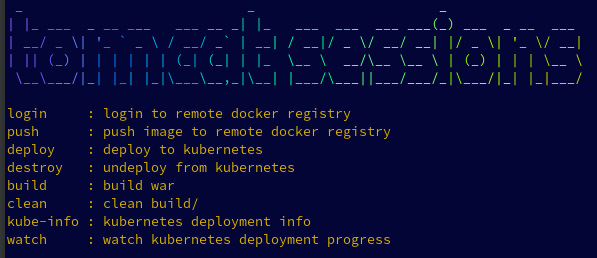

#                                                  

#### This project shows how to configure a simple servlet to run on Tomcat in Kubernetes with distributed session replication.

###### There are two tested configurations:
 - [conf/server.kubernetes.xml](conf/server.kubernetes.xml)
  
This is a basic cluster configuration that leverages the Tomcat cluster membership implementation that gets membership information from the Kubernetes API.[^1] [^2]


 - [conf/server.kubernetes.async.xml](conf/server.kubernetes.async.xml)

This is a configuation that distributes state using the Tomcat pooled parallel asynchronous sender.[^3] [^4]


#### Running ***make*** will list build targets

- DOCKER_REGISTRY 

Define environment variable $DOCKER_REGISTRY for the container registry used.

###### testing tools

- [cli.newsession](cli.newsession)
  
This calls the server at $TARGET (default localhost) to create a new session

- [cli](cli)

After a session is created, this call the server at $TARGET (default localhost) to continue to use the session created previously.

---
###### Sample output:
```json
~/tomcat-sessions(main) $ ./cli.newsession 
calling 10.2.2.150
HTTP/1.1 200 OK
Content-Length: 102
Date: Wed, 31 May 2023 03:30:59 GMT
Set-Cookie: JSESSIONID=48284E4C6E3667C2359AC94602D4B881; Path=/; HttpOnly
Content-Type: text/plain; charset=utf-8

{"count":0,"localName":"tomcat-sessions-78b49fb9b8-rkpmz","localName":"10.42.2.20","localPort":"8080"}
~/tomcat-sessions(main) $ ./cli
calling 10.2.2.150
# Netscape HTTP Cookie File
# https://curl.se/docs/http-cookies.html
# This file was generated by libcurl! Edit at your own risk.

#HttpOnly_10.2.2.150	FALSE	/	FALSE	0	JSESSIONID	48284E4C6E3667C2359AC94602D4B881
HTTP/1.1 200 OK
Content-Length: 102
Date: Wed, 31 May 2023 03:31:04 GMT
Content-Type: text/plain; charset=utf-8

{"count":1,"localName":"tomcat-sessions-78b49fb9b8-krdwt","localName":"10.42.3.21","localPort":"8080"}
~/tomcat-sessions(main) $ ./cli
calling 10.2.2.150
# Netscape HTTP Cookie File
# https://curl.se/docs/http-cookies.html
# This file was generated by libcurl! Edit at your own risk.

#HttpOnly_10.2.2.150	FALSE	/	FALSE	0	JSESSIONID	48284E4C6E3667C2359AC94602D4B881
HTTP/1.1 200 OK
Content-Length: 102
Date: Wed, 31 May 2023 03:31:08 GMT
Content-Type: text/plain; charset=utf-8

{"count":2,"localName":"tomcat-sessions-78b49fb9b8-xssqk","localName":"10.42.1.20","localPort":"8080"}
~/tomcat-sessions(main) $ ./cli
calling 10.2.2.150
# Netscape HTTP Cookie File
# https://curl.se/docs/http-cookies.html
# This file was generated by libcurl! Edit at your own risk.

#HttpOnly_10.2.2.150	FALSE	/	FALSE	0	JSESSIONID	48284E4C6E3667C2359AC94602D4B881
HTTP/1.1 200 OK
Content-Length: 102
Date: Wed, 31 May 2023 03:31:08 GMT
Content-Type: text/plain; charset=utf-8

{"count":3,"localName":"tomcat-sessions-78b49fb9b8-rkpmz","localName":"10.42.2.20","localPort":"8080"}

```
---
#### Kubernetes deployments
[k8s/k8s-role.yaml](k8s/k8s-role.yaml)
Kubernetes role, used to allow Tomcat to call Kubernetes API to get member list of other pods in the same namespace.

[k8s/k8s-deployment.yaml](k8s/k8s-deployment.yaml) 
Kubernetes deployment, set to create 3 replicas for testing.[^4]

[k8s/k8s-ingress.yaml](k8s/k8s-ingress.yaml) 
Kubernetes ingress, used to expose deployment externally.[^5]


[^1]: Tomcat [Clustering](https://tomcat.apache.org/tomcat-10.1-doc/cluster-howto.html)

[^2]: Tomcat [Cloud](https://cwiki.apache.org/confluence/display/TOMCAT/ClusteringCloud)

[^3]: Tomcat [Tribes](https://tomcat.apache.org/tomcat-10.1-doc/tribes/introduction.html)

[^4]: Tomcat [Pooled Sender](https://tomcat.apache.org/tomcat-10.1-doc/config/cluster-sender.html)

[^5]: Kubernetes [Deployment](https://kubernetes.io/docs/concepts/workloads/controllers/deployment/)

[^6]: Kubernetes [Ingress](https://kubernetes.io/docs/concepts/services-networking/ingress/)